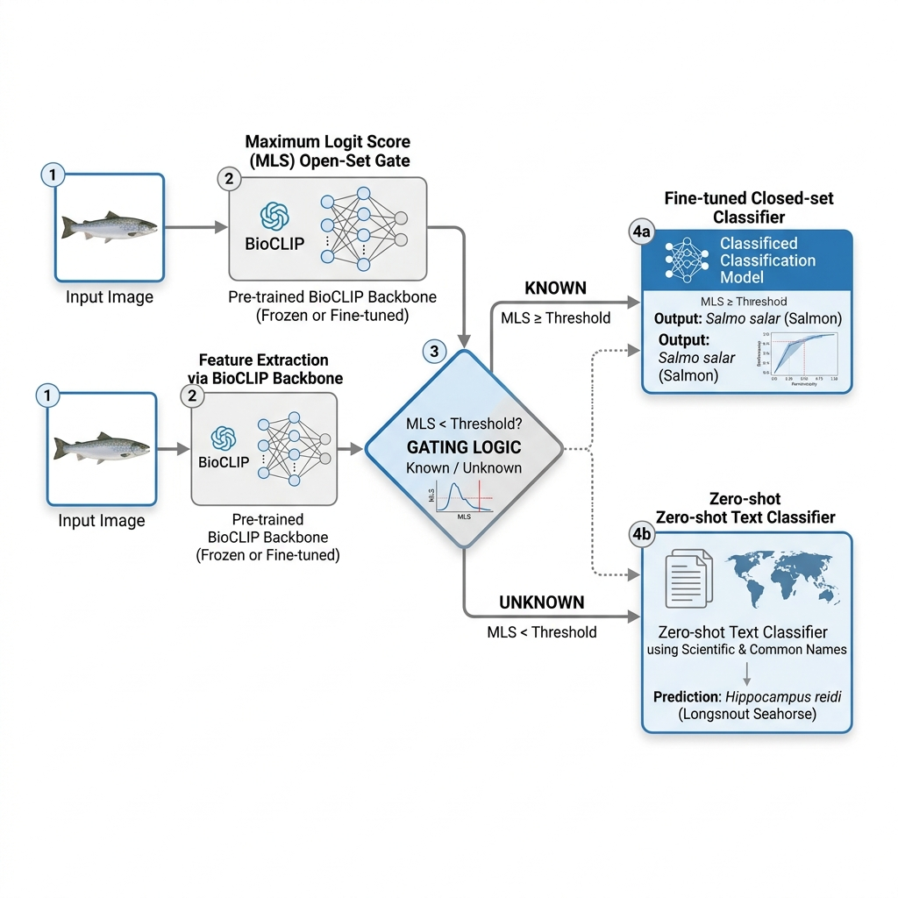
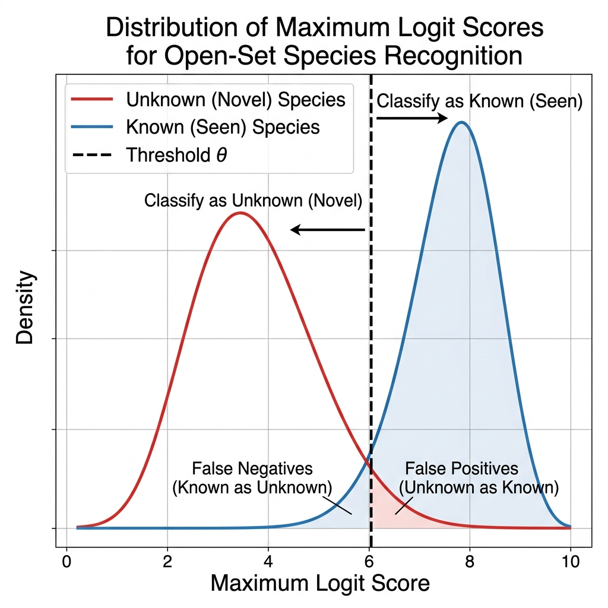

# FishOnet 🐟

> **CV4Ecology 2026 Fish Species Recognition Challenge**  
> An open-set fish species classification framework utilizing BioCLIP 2.5, Calibrated Maximum Logit Score (MLS) Gating, and Description-guided Zero-Shot Retrieval.

---

## 🌟 Overview

FishOnet is an open-set classification pipeline designed to address the challenge of recognizing fish species in natural marine environments. In ecological surveys, systems must classify known species (seen in training data) while detecting and handling unknown, novel species. 

FishOnet addresses this by routing inputs dynamically using a **Maximum Logit Score (MLS)** gate between a fine-tuned **Closed-Set Classifier** (for seen species) and a **Zero-Shot Text Matcher** (for unseen species) powered by **BioCLIP 2.5 Huge** features.

### Key Strategy Components:
1. **Backbone**: Pretrained BioCLIP 2.5 Huge (ViT-H/14) features, specialized in TreeOfLife and marine taxonomy representation.
2. **MLS Gating**: Uses raw logit magnitude rather than normalized softmax probability to detect out-of-distribution (OOD) novel species.
3. **F-Name Text Matcher**: Resolves scientific names to common English names (F-name rule) and leverages class descriptions for zero-shot retrieval of unknown species.

---

## 📊 Project Artifacts

We have created visual and interactive planning artifacts to document our design and execution plan:

### 1. System Architecture
Our routing architecture processes incoming fish images, extracts feature vectors, runs gating logic, and routes to the appropriate classification head.


*Figure 1: High-level routing flowchart of the FishOnet architecture.*

### 2. MLS Gate Calibration
A visual concept of how the Maximum Logit Score separating threshold $\theta$ isolates known seen species distributions from novel unseen species distributions.


*Figure 2: Probability density of maximum logit scores for known vs. unknown species.*

### 3. Interactive Planning Dashboard & MLS Simulator
We built a premium, glassmorphic project dashboard containing an interactive MLS simulator. You can adjust the threshold $\theta$ slider to see how it affects classification metrics (TPR, FPR, Accuracy) across a set of simulated fish samples.


*Figure 3: Screencast demonstrating the interactive simulator and timeline checklist.*

---

## 📂 Repository Layout

```
fishonet/
├── docs/
│   ├── images/
│   │   ├── system_architecture.png  # System flow diagram
│   │   └── mls_calibration.png      # Gating score distributions
│   ├── videos/
│   │   └── dashboard_demo.webp      # Interactive dashboard screencast
│   └── project_plan.md              # Detailed paper-style spec & plan
├── index.html                       # Interactive dashboard HTML
├── index.css                        # Glassmorphism dark-mode style
├── index.js                         # Simulator logic & tab switcher
└── README.md                        # Project landing page (this file)
```

---

## 📑 Detailed Plan
For a full mathematical formulation of the MLS gate, literature citations, dataset statistics, and validation details, read our **[Detailed Paper-Style Project Plan](docs/project_plan.md)**.

---

## 🚀 Running the Interactive Dashboard Locally

To explore the milestones and run the MLS gate threshold simulator on your own machine:

1. Double-click the `index.html` file in the root folder, or host it locally using Python:
   ```bash
   python -m http.server 8000
   ```
2. Navigate to `http://localhost:8000` in your web browser.
3. Select the **MLS Simulator** tab and adjust the threshold slider.